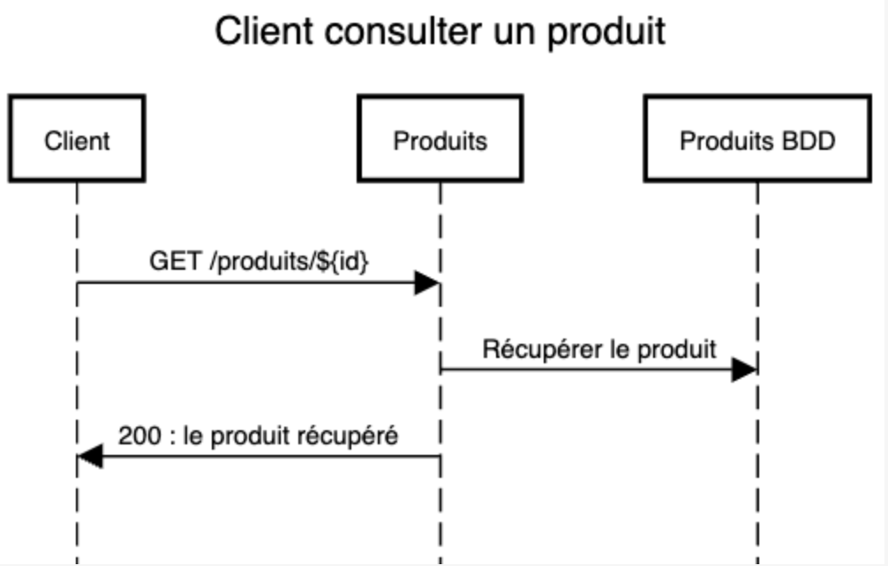
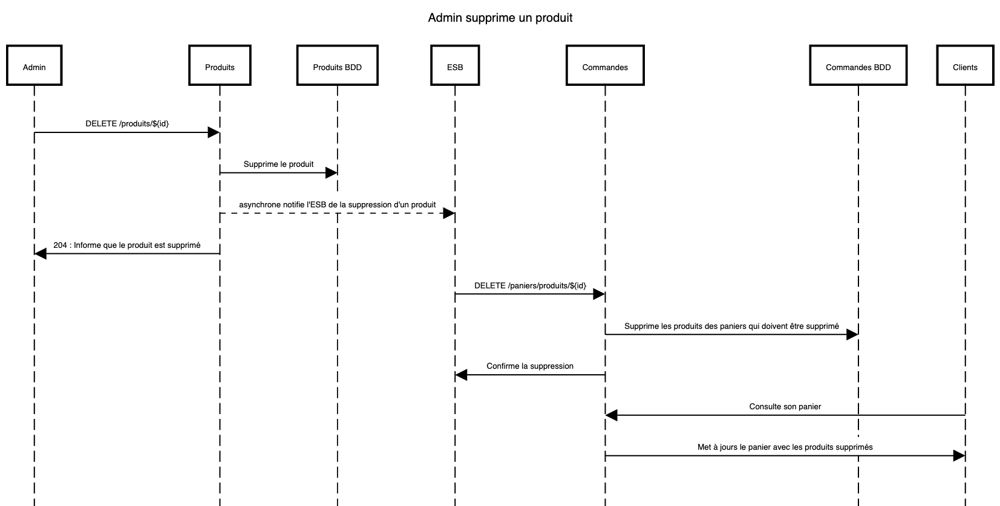

# Projet site de vente en ligne

## Présentation du sujet:
Développement d'une application d'un site de vente en ligne en architecturée en micro-services. 

## Acteur :
- Client
- Gestionnaire


## Cas d'utilisation

### Client :
-   Rechercher un produit 
-   Consulter un produit 
-   Ajouter un produit au panier
-   Supprimer un article du panier
-   Valider son panier
-   Passer une commande
-   Ajouter un article en favoris
-   Retirer un article des favoris
-   Consulter les favoris
-   Consulter sa commande en cours
-   Consulter son historique de commande
-   Se connecter
-   Se déconnecter

### Gestionnaire:
-   Créer / ajouter un produit
-   Modifier un produit
-   Supprimer un produit
-   Consulter un produit
-   Connecter
-   Déconnecter
-   Commander des produits auprès des fournisseurs
-   Créer une carte cadeau
-   Supprimer une carte cadeau
-   Modifier une carte cadeau
-   (Gérer les moyens de paiement)
-   Consulter les commandes en cours


## Microservice

Il y a sept microservices :

- Service de notification
- Service d'authentification
- Service de gestion d'achat
- Service de gestion de carte cadeau
- Service de gestion de produit
- Service de gestion de paiement
- Service de gestion de commande


## Diagramme de séquence


### Client
Consulter un produit:
    
```
title Client consulter un produit

Client->Produits:GET /produits/${id}
Produits->Produits BDD: Récupérer le produit
Produits->Client: 200 : le produit récupéré
```




### Admin
Supprimer un produit:

```
Admin->Produits:DELETE /produits/${id}
Produits->Produits BDD:Supprime le produit
Produits-->ESB:asynchrone notifie l'ESB de la suppression d'un produit
Produits->Admin: 204 : Informe que le produit est supprimé
ESB->Commandes: DELETE /paniers/produits/${id}
Commandes->Commandes BDD: Supprime les produits des paniers qui doivent être supprimé
Commandes->ESB: Confirme la suppression
Clients->Commandes: Consulte son panier
Commandes->Clients: Met à jours le panier avec les produits supprimés
```



